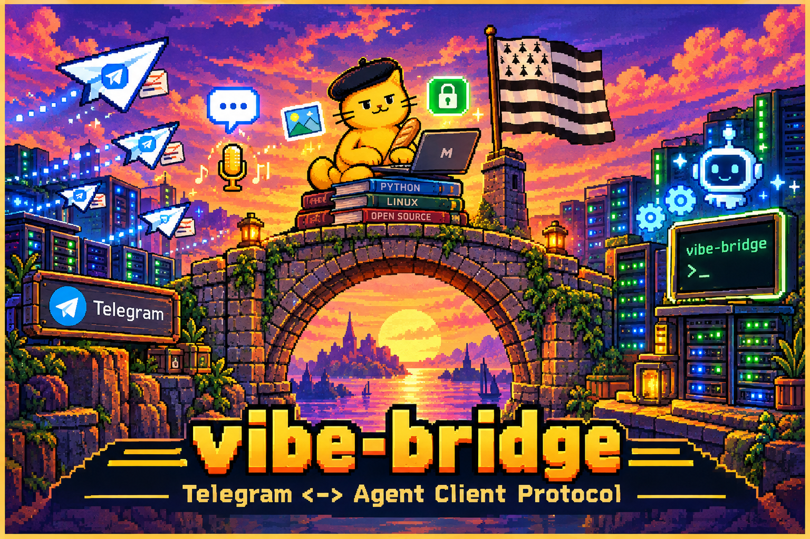

# vibe-bridge

[English](README.md) | [Français](README.fr.md)



Telegram <-> [vibe-acp](https://github.com/mistralai/mistral-vibe) gateway:
drive Mistral Vibe from Telegram over the Agent Client Protocol (JSON-RPC 2.0
on stdio), with no intermediate SDK — the ACP client is built in
(`vibe_bridge/acp.py`, ~150 lines).

## Features

### Inputs

- **Text**: one message = one prompt (queued if the agent is busy,
  one cycle at a time)
- **Voice notes and audio files**: transcribed via Mistral's Voxtral API
  (requires `MISTRAL_API_KEY`); the transcript becomes the prompt
- **Images**: Telegram photo or image attachment -> ACP block
  `{type: "image", data: <base64>, mimeType}`; the caption is used as the
  instruction (default: "Décris cette image.")

### Rendering

- Response streamed with in-place message edits, automatic splitting at
  3800 characters
- Model thinking shown live during long generations (`agent_thought_chunk`)
- Final answer rendered as rich HTML (markdown converted in the bridge,
  with a plain-text fallback if Telegram rejects the rendering)
- "typing…" indicator shown for the whole duration of a cycle

### Control

- `/new` — new session (restarts the agent)
- `/resume` — recent sessions as inline buttons (`session/list`), resumed via
  `session/load` on click
- `/interrupt <instruction>` (alias `/i`) — cancels the current cycle and
  follows up on the same session: the agent keeps the context of its
  partial work
- `/mode` — session mode as buttons (ask / accept-edits / auto-approve)
- `/model` — session model as buttons
- `/session` — current state — `/stop` — interrupt and clear the queue
- `/doctor` — full diagnostic: bridge (uptime, errors, timeout retries),
  Telegram token, Mistral key, agent (session, mode, model), cycle, and
  container RAM/swap/disk. Answers even with no active session.

### Permissions

- Every agent permission request -> inline buttons
  (Allow once / session / Always / Deny), immediate visual feedback on click,
  auto-deny after 5 minutes
- **Safety net**: a permission request always gets an answer — if the
  handler fails, `cancelled` is sent (the agent never hangs)

### Robustness

- Automatic retry of Telegram connection timeouts (request never sent =
  no risk of duplicates)
- ACP stdio limit raised to 32 MiB (asyncio's 64 KiB default silently killed
  the reader on large messages); the reader is cancelled **before** the
  agent process dies (the reverse order froze the whole event loop)
- Strict allowlist: `TELEGRAM_ALLOWED_USER_IDS` is mandatory — the bridge
  refuses to start without it

## Configuration (environment variables)

| Variable | Required | Default |
|---|---|---|
| `TELEGRAM_BOT_TOKEN` | yes | — |
| `TELEGRAM_ALLOWED_USER_IDS` | yes | — |
| `ACP_AGENT_COMMAND` | no | `vibe-acp` |
| `VIBE_BRIDGE_WORKSPACE` | no | `/home/vibe/workspace` |
| `VIBE_BRIDGE_TRANSCRIBE_MODEL` | no | `voxtral-mini-latest` |
| `VIBE_BRIDGE_STDIO_LIMIT` | no | `33554432` (bytes) |
| `MISTRAL_API_KEY` | for voice notes | — |
| `VIBE_BRIDGE_PROMPT_TIMEOUT` | no | `900` (seconds) |
| `VIBE_BRIDGE_LOG_LEVEL` | no | `INFO` |

## Agent identity and memory (outside the bridge, on the vibe-acp side)

- `~/.vibe/AGENTS.md` (global): identity and tone — **the workspace AGENTS.md
  is not loaded** in ACP mode (untrusted directory); only the global one is
- `<workspace>/MEMORY.md`: durable facts read and maintained by the agent
  itself (instruction in AGENTS.md) — plain markdown, no embeddings
- `~/.vibe/config.toml`: `default_agent = "ask"` to require approval for
  every tool call

## Installation (Linux, Python 3.11+)

```bash
git clone https://github.com/eowindel/vibe-bridge.git
cd vibe-bridge
uv venv
uv pip install --python .venv/bin/python -e .
```

## systemd service

Example (adapt user, paths and environment files to your setup):

```ini
[Unit]
Description=vibe-bridge : Telegram gateway to vibe-acp
After=network-online.target
Wants=network-online.target

[Service]
Type=simple
User=vibe
Group=vibe
WorkingDirectory=/home/vibe
Environment=HOME=/home/vibe
EnvironmentFile=/home/vibe/bot.env
EnvironmentFile=/home/vibe/bot.token.env
EnvironmentFile=/home/vibe/.vibe/.env
ExecStart=/home/vibe/vibe-bridge/.venv/bin/vibe-bridge
Restart=on-failure
RestartSec=5

[Install]
WantedBy=multi-user.target
```

Then `systemctl daemon-reload && systemctl enable --now vibe-bridge`.

## ACP pitfalls found in production

Each of these cost a debugging session — the bridge handles them all, but
they are worth knowing if you write your own ACP client:

- `session/cancel` must be sent as a **notification** (a request with an id
  is rejected by vibe-acp with "method not found")
- `session/request_permission` sends options as `optionId`/`name`
  (not `id`/`option.text`), and a client must **always** answer — otherwise
  the agent hangs forever
- `LoadSessionResponse` has no `sessionId` field (the ID passed in the
  request is the one that counts)
- httpx logs API URLs (including the token) at INFO level -> set the logger
  to `WARNING`
- asyncio's default stdio limit (64 KiB) is deadly for an ACP bridge:
  one large agent message silently killed the reader

## Project origin

Built for single-user personal use: drive your Vibe agent from your phone,
with human approval of sensitive actions. It was born from the experience
with `telegram-acp-bot` (unbounded dependencies, agent reply lost on a
network timeout with ACP sender corruption on the SDK side, session killed
by an oversized ACP exchange): here, the ACP client is built in and
minimal, and the only external dependency is `python-telegram-bot`.

> Note: user-facing bridge messages are currently in French. An i18n option
> is on the roadmap.
